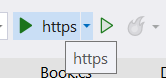
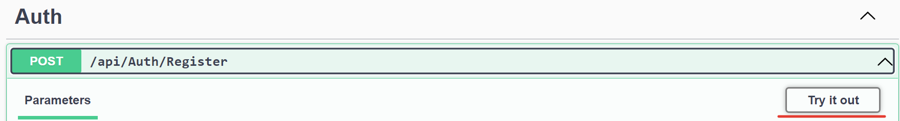
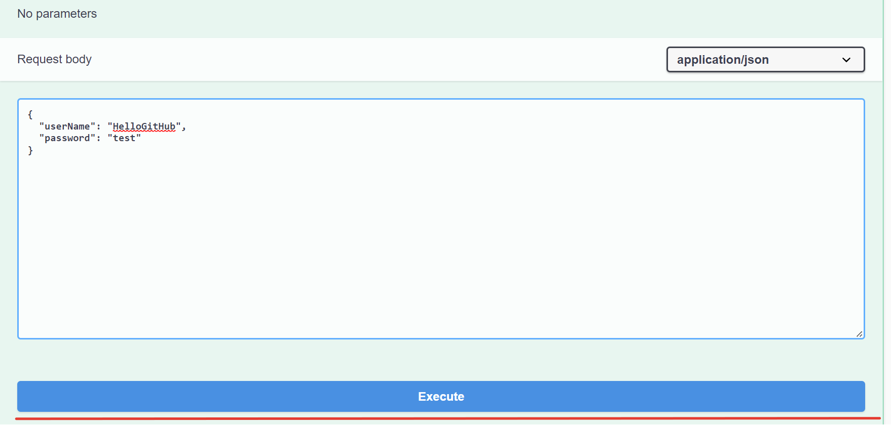
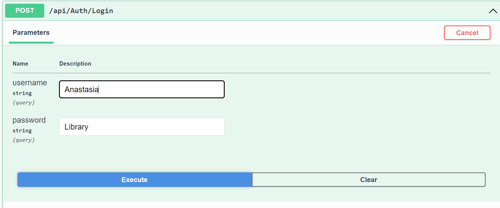
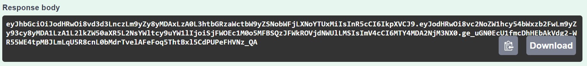
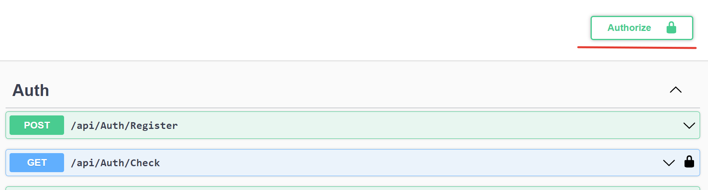
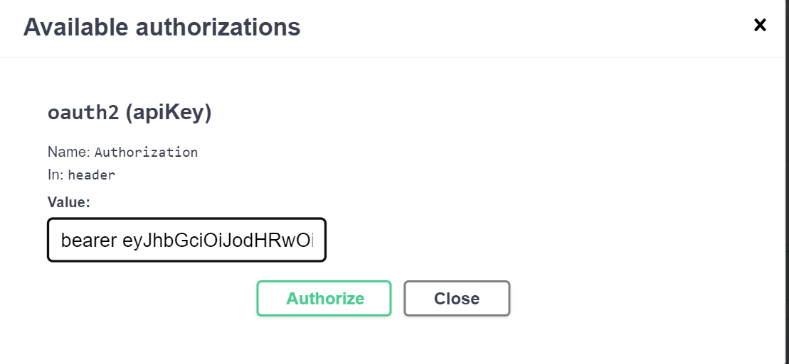
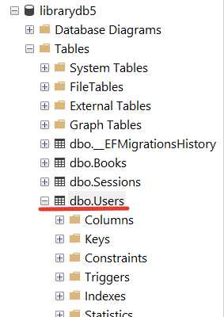
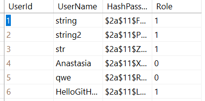
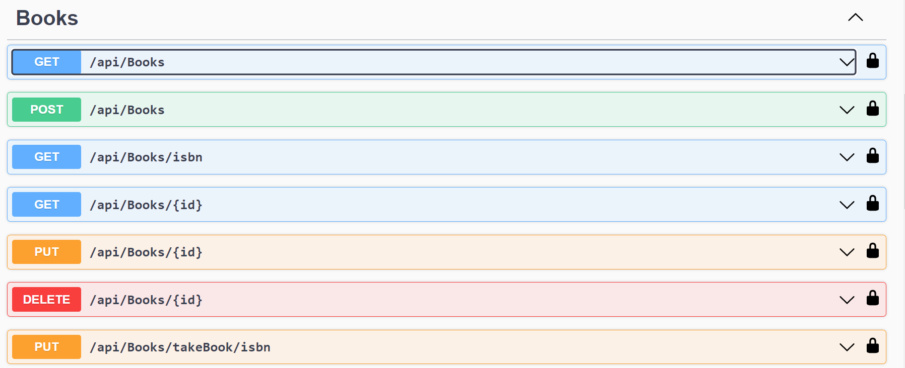

EntityFramework Core + .NetCore + Authentication via bearer token + GRUD WebAPI + AutoMapper + Swagger + SQL Server

# Get started

# Start

- Clone repository.
- Start project by click on button.

  

# Work

- Register. Open Auth. Run the POST query Register. Click "Try it out".

- Enter your login and password and click "Execute".

- Execute login query.

- Copy your token in response body.

- CLick button Authorize and enter your token as a picture. Insert "bearer " insert the token.

- In order to get admin rights(update books, delete book, find by ID) go to database. Change role to 0 in Users table.
  If you have role : 1 you can only see all books and find book by isbn.

- Work with books

